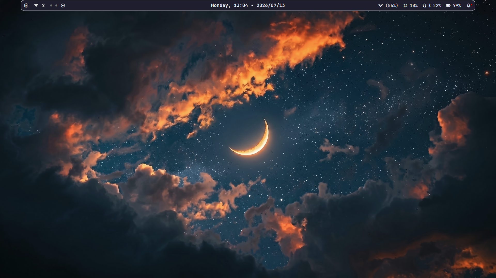
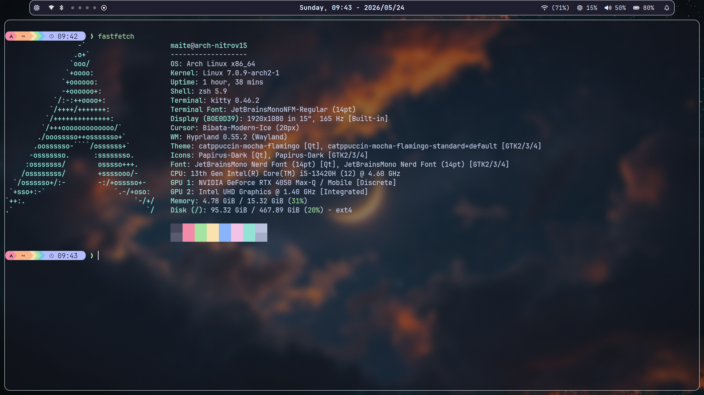
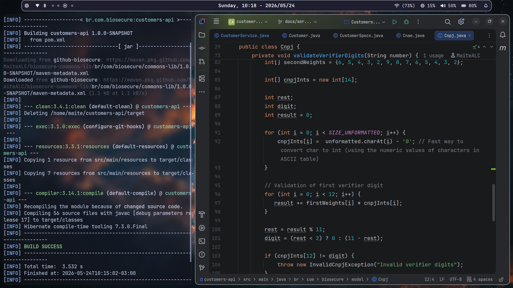
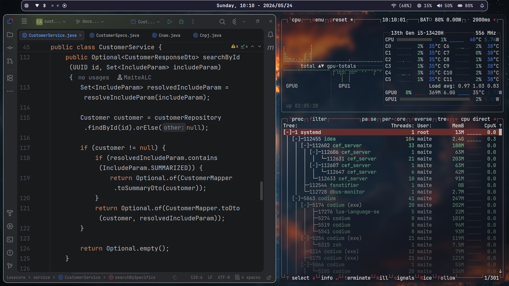
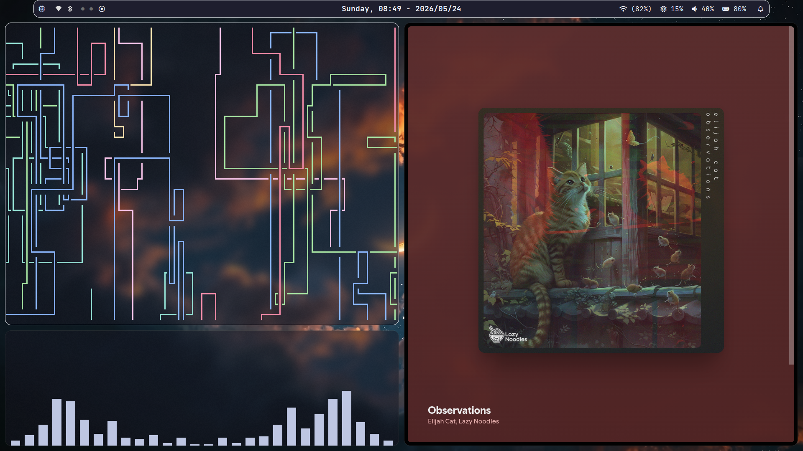
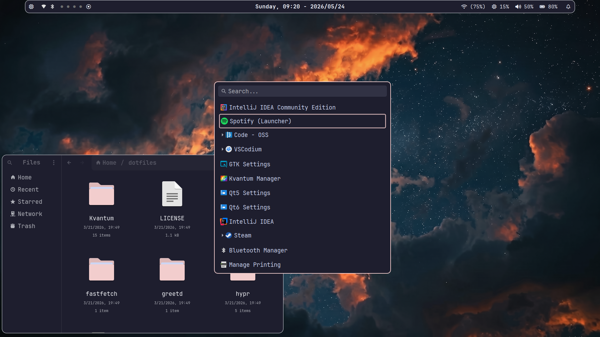
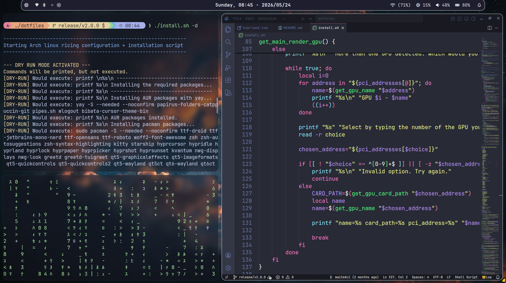
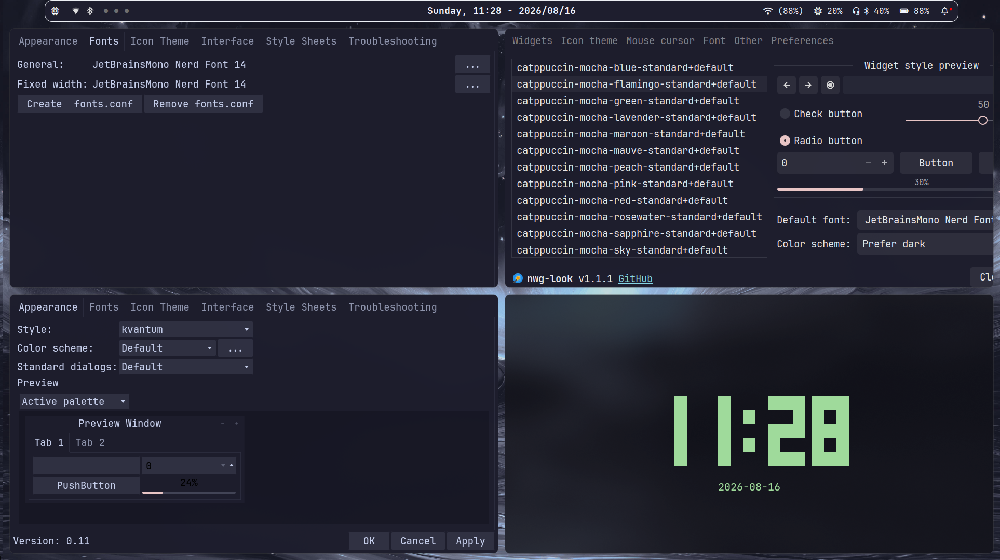

# ☕ Catppuccin Mocha - Hyprland Dotfiles


This repository contains my personal rice, based on Hyprland, focused on Catppuccin
Mocha and automated by an installation script. The current dotfiles version is based
on Hyprland v0.55, with **Lua-based** configurations. Check the
[v1.0.0-legacy-hyprlang](https://github.com/MaiteALC/dotfiles/releases/tag/v1.0.0-legacy-hyprlang)
to access the legacy version with static `.conf` files.

---

## ⚙️ The Installation Script (install.sh)

The distinguishing feature of this repository is its self-sufficient post
installation script. It was projected to be executed in a clean Arch Linux installation,
in other words, without DEs (Desktop Environments) like KDE Plasma or GNOME.

### Script features

- **Hardware Detection:** automatic GPUs detection to install the appropriated drivers
(like nvidia-prime for Nvidia, vulkan-radeon for Amd, vulkan-intel for Intel).

- **Intelligent AUR Helper:** Detects yay or paru. If none was found, installs
yay automatically.

- **Dry-Run Mode:** Allows test all the script without alter a single file in
your system.

- **Symlink Management:** Make symlinks between the repository and your ~/.config/
directory in a clean way.

- **Backup:** Automatically creates a backup directory (~/.rice_backup) and put
all your previous configuration to avoid losing files.

- **Color Consistency:** Applies the Catppuccin Mocha accents in the Papirus Dark
icon theme via CLI.

- **Wallpapers:** Provides a set of wallpapers to match the Hyprland style.

---

## 🍚 Rice Components

| Category | Tool | Description |
| :--- | :--- | :--- |
| **Compositor** | [Hyprland](https://hyprland.org/) | Dinamic windows and fluid animations |
| **Status Bar** | [Waybar](https://github.com/Alexays/Waybar) | Highly customizable status bar |
| **Colors** | [Catppuccin](https://github.com/catppuccin/catppuccin) | Mocha flavor for all the system |
| **App Launcher** | [Wofi](https://wiki.archlinux.org/title/Wofi) | Fast and minimalist app launcher stylized using CSS |
| **Notifications** | [SwayNC](https://github.com/ErikReider/SwayNotificationCenter) | Complete notification center |
| **Terminal Emulator** | [Kitty](https://sw.kovidgoyal.net/kitty/index.html) | GPU-accelerated terminal emulator |
| **Shell** | [Zsh](https://www.zsh.org/) | Modern, powerfull and customazible shell with starship prompt |
| **Clipboard** | [Cliphist](https://github.com/sentriz/cliphist) | Minimalist and integrated with Wofi |
| **Wallpapers** | [Hyprpaper](https://wiki.hypr.land/Hypr-Ecosystem/hyprpaper/) |  Native tool from hypr ecossystem |
| **Text Editor** | [Neovim](https://github.com/neovim/neovim) | Vim-fork focused on extensibility and usability |

---

## 🛠️ How to Install

> [!NOTE]
> It's a good practice review scripts downloaded from internet before execute them.

*1. Clone the repository:*

```bash
git clone https://github.com/MaiteALC/dotfiles.git
cd ~/dotfiles
```

*2. Change the permissions:*

```bash
chmod u+x install.sh
```

*3. Execute the Test (Dry-Run):*

```bash
./install.sh --dry-run
```

*4. Real Execution:*

```bash
./install.sh
```

---

## ⌨️ Main Keybinds

- Super + Return (Enter) = terminal (kitty)

- Super + R = app launcher (wofi)

- Super + X = clipboard history (cliphist/wofi)

- Super + L = lock the screen (hyprlock)

- Super + Shift + F = fullscreen

Check the ```.config/hypr/modules/binds.lua``` file to see all keybinds.

---

## 📸 Showcase

<p align="center">
  
  
</p>

<p align="center">
  
  
</p>

<p align="center">
  
  
</p>

<p align="center">
  
  
</p>